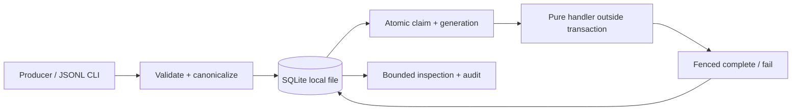
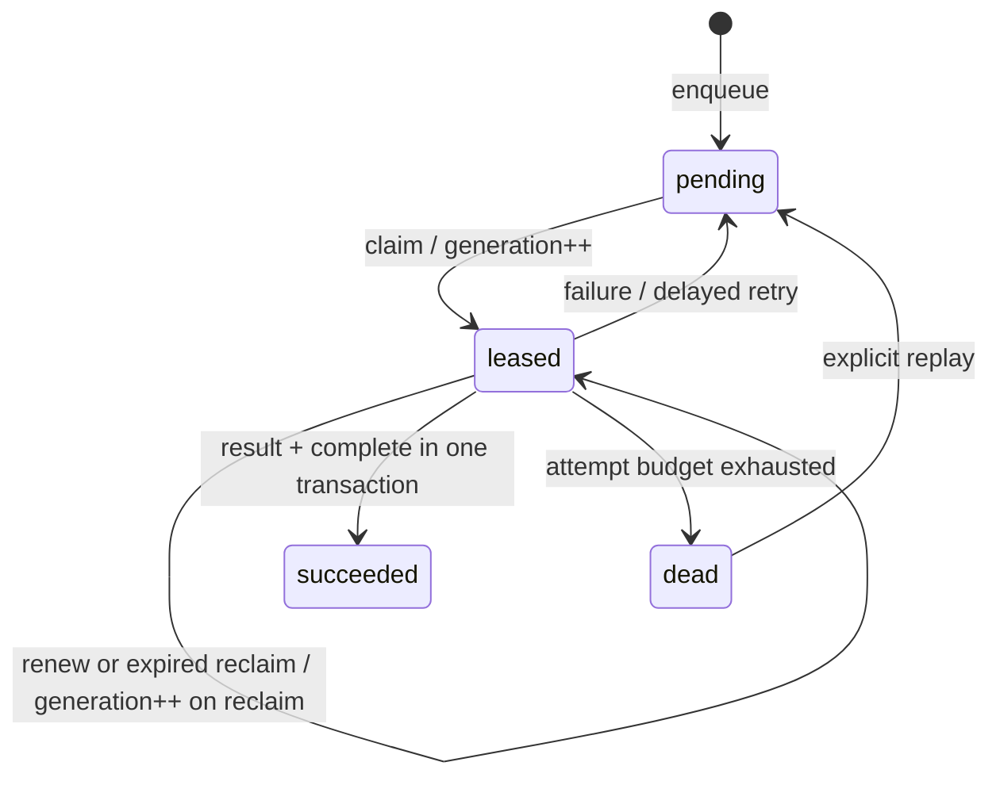

# Architecture

## Data model

- `jobs`: unique source/key, canonical input, status, generation, attempts,
  per-job attempt budget, next eligibility time, lease owner/expiry, timestamps.
- `results`: one row keyed by job ID, canonical JSON output, publishing generation.
- `transitions`: append-only history of accepted state changes, including explicit
  replay. It shares the transaction of the state change it describes.
- `PRAGMA user_version`: schema version; an unknown version is rejected.

State machine:

## Correctness boundary

Every mutation begins with `BEGIN IMMEDIATE`, which obtains SQLite's write
reservation before reading the row used for a decision. It removes the race
between selecting a pending job and claiming it. The write transaction is the
linearization boundary; a successful commit becomes visible to later transactions.

The handler runs after the claim transaction has closed. Long computation does
not hold the database write lock. Completion checks four facts together:
`status == leased`, matching worker, matching generation, and `lease_until > now`.
Time is sampled **after** acquiring the write reservation, so lock wait does not
permit a decision based on a time from before the wait.

Generation is monotonic across retries and manual replay. A worker name is a
diagnostic label, not an authentication credential. A copied current lease is a
capability inside a trusted process environment; this library is not a tenant
security boundary.

The result and success transition are written atomically. If the process crashes
before commit, both roll back. If it crashes after commit but before seeing the
return value, resubmitting the same input cannot create a second result. Running
the handler twice is allowed. Calling an external API from a handler introduces
a separate commit boundary and needs destination idempotency or an outbox design.

## Persistence and contention

One local file, one write transaction at a time, a bounded SQLite busy timeout,
foreign keys and CHECK/UNIQUE constraints enabled. Each operation opens its own
connection; library objects do not share connections between threads/processes.
An operation can raise a database error when the disk or lock wait fails. The CLI
returns a failure rather than acknowledging a write that did not commit.

Rollback journal mode with FULL synchronization is a conscious initial tradeoff:
reader/writer overlap is more limited than WAL, but checkpoint management is absent.
The development Python bundles SQLite 3.49.1. SQLite documents a WAL-reset race
fixed in 3.51.3 (with specified backports). We do not turn on WAL on an unpatched
runtime merely to produce a faster benchmark. A future WAL comparison must use a
patched build and keep durability settings equal.

Sources: [SQLite transactions](https://www.sqlite.org/lang_transaction.html),
[SQLite WAL and its version caveats](https://www.sqlite.org/wal.html).

## Time and scheduling

Persisted expiry uses one host's wall clock, allowing state to survive process
restart. Tests inject a clock and advance it without sleeps. Clock jumps can delay
recovery or cause early expiry; fencing still protects accepted writes. A worker
must renew before expiry for a long handler. The initial CLI handles short jobs
and exits when no job is currently eligible. It is not a resident polling service.

Retry delay is `min(cap, base * 2**(attempt - 1))`. Jitter is deferred; synchronized
retry storms are an explicit experiment for a real integration. Claim order uses
eligibility time then job ID, with no strict global FIFO promise across retries.

## Code responsibilities

- `store.py`: schema, transactions, identity, leases, results, history, inspection.
- `worker.py`: handler protocol, job normalization example, one-job worker step.
- `cli.py`: argument parsing, JSONL validation, bounded output, exit codes.
- `demo.py`: deterministic timeline explaining duplicates, recovery, stale owners.
- `benchmark.py`: bounded multi-process workload with machine-readable results.

## Failure table

| Failure | Result |
|---|---|
| Duplicate enqueue | Same job ID; no second job |
| Identity reused with different data | Explicit conflict |
| Worker dies after claim | Lease expires; a new generation can run |
| Worker dies during result transaction | SQLite rolls back partial result |
| Old worker returns after timeout | Fenced rejection |
| Handler repeatedly fails | Bounded retries, then dead letter |
| Last allowed attempt dies | Next claim sweep moves it to dead |
| Disk failure / lock timeout | Caller receives error; no false acknowledgment |
| Machine/disk is lost | No replication; recovery depends on a backup |
| External effect before crash | May repeat; outside local result guarantee |

## Operational boundary

Trusted local users only; filesystem permissions govern access. No payloads in
logs, parameterized SQL, strict JSON/size limits, and no eval or pickle. Inspection
can intentionally reveal stored input/output to the local operator. No retention
deletion is implemented, because deleting identities changes duplicate semantics.
Use SQLite's backup API or stop all writers before copying the complete database.
Do not put the live database on cloud-synced storage or a network share.
